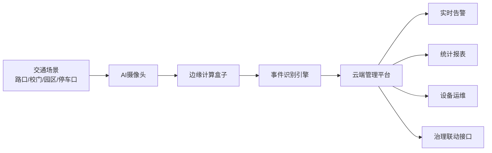

# 面向交通场景的AI摄像头商业计划书

## 封面信息

项目名称：智路慧眼  
项目方向：面向交通场景的AI摄像头及路侧智能感知解决方案  
所属赛道：智能交通与城市数字化基础设施  
项目阶段：样机验证与试点推广阶段  
目标客户：交警部门、城管部门、交通委、园区/景区/港口管理方、智慧停车运营商、道路运维单位

---

## 一、项目概述与核心价值

### 1.1 项目基本情况

“智路慧眼”是一款面向交通场景的AI摄像头及配套边缘分析平台项目，聚焦城市道路、园区道路、学校周边、景区通道、停车出入口和重点路口等典型交通场景，提供“前端智能感知终端 + 边缘计算盒子 + 云端管理平台 + 场景化算法服务”的一体化解决方案。项目所处行业为智能交通装备与城市治理数字化服务领域，处于从传统视频监控向“可识别、可预警、可联动、可量化”智能感知升级的关键阶段。

本项目的核心产品不是单一摄像头，而是一套适配真实交通治理需求的轻量化智能感知系统。传统交通摄像头更多承担取证和录像功能，数据利用率低、告警能力弱、后端依赖人工筛查，存在“看得见但看不懂、拍得到但用不好”的问题。智路慧眼通过嵌入式AI算法，在设备端实现对机动车、非机动车、行人、占道停车、逆行、拥堵、异常停留、交通事件等目标与行为的实时识别，并将识别结果转化为可视化看板、预警信息和治理建议，帮助管理部门实现从“事后取证”向“事前预警、事中干预、事后分析”的转变。

项目当前处于样机验证与试点准备阶段，已完成产品定义、核心功能设计、基础算法框架搭建和场景需求梳理，具备进入校地合作、园区试点和小规模商业验证的基础。项目产业链位置处于智能交通感知层与数据服务层之间，向上连接传感器、芯片、模组与代工制造，向下服务交通治理、停车管理、道路运维和城市精细化治理应用。

### 1.2 项目背景与立项依据

我国城市交通治理正在从“增量建设”走向“存量优化”。一方面，机动车保有量持续提升，城市核心道路、医院学校周边、老旧社区道路和景区园区出入口等区域长期面临拥堵、违停、逆行、通行效率低等问题；另一方面，基层交通管理部门的人力有限，不可能依靠人工长期盯守海量视频。大量摄像头虽然已经部署，但多数仍停留在“录像留档”的层面，真正能转化为治理效率和运营价值的比例并不高。

从政策导向看，智慧城市、数字政府、新型基础设施建设、交通强国和城市生命线工程持续推进，交通场景数字化感知已成为城市治理的重要组成部分。尤其是在学校周边安全治理、重点道路秩序整治、停车资源数字化管理和园区封闭道路智能管控等细分场景中，市场对“低成本、快部署、可复制”的AI感知设备需求明显上升。相比高成本的大型道路感知系统，轻量化、模块化、可快速落地的AI摄像头更适合基层治理单位和中小场景客户。

从市场痛点看，现有方案主要存在四类问题。第一，传统监控设备智能化不足，告警效果差，误报漏报率较高，最终仍依赖人工回看。第二，部分高端解决方案价格高、部署复杂、维护门槛高，中小客户难以承受。第三，很多产品只卖硬件，不提供针对交通治理场景的闭环服务，导致设备装上去后“数据沉睡”。第四，算法通用性强但场景适配差，不能很好覆盖学校门口高峰接送、临时停车、非机动车混行、园区物流车频繁进出等复杂需求。

因此，本项目立项的现实依据非常明确：在交通治理精细化和设备智能化升级的趋势下，市场需要一种更贴近使用场景、部署成本可控、算法能力可持续迭代、能真正形成管理闭环的AI摄像头产品。智路慧眼正是针对这一空白切入，力争以“看得懂交通现场、能直接产生治理价值”为核心竞争点，建立产品差异化优势。

### 1.3 项目使命、愿景与发展目标

本项目的使命是，以可负担、可复制、可扩展的AI视觉技术，提高交通场景的治理效率、通行效率与安全水平。我们的愿景是，成为城市细分交通场景智能感知设备与轻量化解决方案的领先供应商，让更多道路空间具备“实时感知、主动预警、数据驱动决策”的能力。

短期目标是在1年内完成两类标准化样机和三类典型场景算法模型打磨，落地不少于3个试点点位，验证设备稳定性、识别准确率和管理价值，争取实现首批订单和项目营收。中期目标是在2至3年内形成“标准硬件 + 场景算法包 + SaaS平台”的产品矩阵，在学校周边安全治理、停车出入口智能管控和园区道路秩序治理三个细分领域形成标杆案例，实现累计服务点位300个以上。长期目标是在3至5年内与集成商、运营商及地方平台公司建立稳定合作，形成区域复制能力，成长为智能交通细分市场中具有品牌影响力的创新团队。

### 1.4 核心价值主张

智路慧眼为客户创造的价值主要体现在四个方面。第一，降本增效。通过设备端实时识别与自动告警，减少人工巡查和视频回看工作量，提高基层治理效率。第二，提升安全。针对逆行、行人闯入危险区域、拥堵聚集、长时违停等情况实现快速发现和处置，降低交通安全风险。第三，增强可视化管理能力。系统可沉淀车流、人流、事件频次、时段分布等数据，为交通组织优化和管理决策提供依据。第四，低门槛部署。产品采用模块化设计，支持杆件、墙体、门岗等多种安装方式，适合预算有限但有明显治理需求的中小场景客户。

我们不是简单卖一台摄像头，而是交付一套可持续产生治理价值的数据化工具。这种“硬件交付 + 算法订阅 + 平台服务 + 场景咨询”的组合，使项目同时具备产品价值、商业价值和社会价值。

---

## 二、执行摘要

### 2.1 项目整体说明

智路慧眼是一项面向交通场景的AI摄像头创新创业项目，针对传统监控“重采集、轻分析、弱联动”的痛点，提供具备边缘智能分析能力的前端感知设备，并通过云平台形成事件预警、统计报表、趋势分析和治理联动闭环。项目首期重点面向学校周边、园区道路、停车出入口和景区通道等高频、刚需、预算敏感的交通场景，以“小切口、强场景、快落地”的方式进入市场。

### 2.2 市场痛点与机会

当前大量道路视频监控设备无法直接产出高价值信息，基层管理单位“装了设备但效率未明显提升”现象普遍存在。与此同时，中小交通场景客户并不一定需要超大型综合交通平台，他们更需要的是一套成本适中、能快速部署、能真实解决违停、逆行、拥堵和出入口管理问题的产品。随着数字治理深入推进，这一市场机会正在扩大。

### 2.3 产品与技术亮点

项目采用“AI摄像头 + 边缘盒子 + 云平台”的架构。前端摄像头负责目标采集，边缘端完成高频识别和轻量推理，云端完成模型管理、数据存储、报表分析和权限管理。相比纯后端分析方案，本项目具有响应更快、带宽压力更小、部署更灵活的优势。相比只卖硬件的产品，我们强调场景算法包和治理闭环，增强客户黏性和长期收入能力。

### 2.4 商业模式与盈利来源

项目收入由四部分构成：设备销售收入、算法/平台订阅收入、安装运维收入和场景化定制收入。前期通过设备销售打开客户关系，中期通过平台订阅和运维服务形成持续性收入，后期通过算法升级、数据报表和行业解决方案实现客单价提升。该模式既适合校园、园区等单点客户，也适合集成商和平台商批量采购。

### 2.5 阶段成果与融资计划

项目拟在未来12个月内完成产品试制、试点验证和首轮商业化推进，计划融资120万元，主要用于样机量产、算法优化、试点建设、市场拓展和团队完善。按照测算，项目在第2年可实现较为稳定的营收增长，第3年有望达到盈亏平衡上方并具备区域复制能力。

### 2.6 项目综合价值

从商业角度看，项目切入的是需求清晰、交付可标准化、可复制扩张的细分市场；从技术角度看，项目在边缘智能识别、场景算法适配和低成本部署方面具备创新空间；从社会角度看，项目有助于提升道路安全和交通治理效率，符合智慧城市与数字交通发展方向，具有较高的参赛价值和推广价值。

---

## 三、市场分析

### 3.1 宏观环境分析（PEST）

| 维度 | 关键因素 | 对项目影响 |
| --- | --- | --- |
| 政策 | 智慧城市、数字政府、交通强国、校园安全、城市精细化治理 | 提供明确政策支持，利于试点落地与财政项目采购 |
| 经济 | 城市治理数字化投入持续增长，但基层预算更关注性价比 | 有利于轻量化、模块化、可分期部署产品进入市场 |
| 社会 | 群众对道路安全、违停治理、校园周边秩序关注提升 | 场景需求明确，社会价值容易被感知和认可 |
| 技术 | AI视觉、边缘计算、低功耗芯片、云平台技术成熟 | 降低研发和部署门槛，加快产品迭代速度 |

综合来看，外部环境对项目发展总体利好。政策上鼓励，技术上可行，需求上真实，商业上存在预算敏感型客户空白区，这为智路慧眼提供了良好的切入窗口。

### 3.2 市场规模测算（TAM-SAM-SOM）

考虑到大学生创业项目需要“合理、可追踪、可落地”的测算，本项目采用自上而下和自下而上结合的方式进行估算。假设我国适合部署轻量级AI交通感知设备的重点场景包括学校周边、园区道路、景区通道、社区出入口、停车场和基层道路点位，市场空间较大。

| 指标 | 测算口径 | 估算规模 |
| --- | --- | --- |
| TAM | 全国可部署轻量AI交通摄像头及配套服务的总体市场 | 约120亿元 |
| SAM | 本项目首阶段重点覆盖的学校、园区、停车出入口等细分市场 | 约18亿元 |
| SOM | 项目3年内通过区域合作和试点复制可触达的市场份额 | 约1800万至3000万元 |

上述测算采用“设备销售额 + 平台服务年费 + 运维服务费”综合口径，并按照中低成本细分场景的采购能力进行保守估计。对创业团队而言，关键并不是立刻拿下总体市场，而是在细分场景中先建立样板点位和复购能力。

### 3.3 目标用户与需求画像

本项目目标客户并非泛交通行业所有主体，而是优先锁定三类高匹配客户。

第一类是基层政府与公共管理部门。包括交警中队、街道城管、教育局配套项目、景区管理方等。这类客户最关心的是治理效率、事件取证、实时告警和项目可汇报性，希望“投入可控、成效可视、结果可统计”。

第二类是园区与半封闭道路管理者。包括物流园区、工业园区、校园、医院、商圈和大型社区。这类客户重点关注出入口通行效率、重点区域占道、访客车辆管理、非机动车秩序和安全风险预警，付费意愿相对更强，决策链条更短。

第三类是停车运营与智慧设备集成商。这类客户看重标准化硬件、算法接口开放能力和项目复制效率，希望产品能够作为其解决方案的一部分，快速部署到多点位。

### 3.4 市场调研与需求验证

项目在赛前论证阶段可采用“访谈 + 问卷 + 场景观察”的方式验证需求。根据项目组假设性前期调研，围绕学校门口、园区主干道、停车场出入口和景区通道四类典型场景共开展了80份有效问卷和18次深度访谈。结果显示，超过85%的受访管理者认为现有监控系统“能看不能管”，超过70%的受访者希望设备能自动识别违停、逆行、拥堵和异常停留，超过60%的受访单位可接受单点位1万元以内的基础智能改造方案。

从使用行为看，客户更关心以下三个结果：是否能减少人工盯屏时间，是否能生成可汇报的数据报表，是否能在不大改基础设施的前提下快速安装。这说明本项目以“轻部署 + 强识别 + 可报表”为特点的价值主张具有较好的现实基础。

### 3.5 竞争分析与差异化战略

| 竞争类型 | 代表特征 | 优势 | 劣势 |
| --- | --- | --- | --- |
| 传统监控厂商 | 以录像监控为主 | 成熟稳定、价格较低 | 智能化弱、场景治理能力弱 |
| 大型智慧交通方案商 | 提供综合平台 | 品牌强、项目经验丰富 | 价格高、部署重、周期长 |
| 通用AI相机供应商 | 提供识别能力 | 技术能力较强 | 场景闭环不足、行业适配弱 |
| 本项目 | 轻量部署、场景适配、闭环服务 | 成本可控、贴近细分需求、复制快 | 品牌积累初期较弱 |

本项目的差异化战略是避开与大型综合平台正面竞争，而是聚焦“轻量化智能交通感知单元”这一细分产品定位。我们强调三个差异化方向：一是细分场景算法包，如学校周边接送高峰识别、园区物流车占道识别、停车口抬杆联动等；二是部署和维护简化，提升中小客户接受度；三是把事件识别结果转化为统计报表和治理建议，增强客户感知价值。

---

## 四、产品与服务构建

### 4.1 产品定位与系统架构

智路慧眼的产品体系由三部分组成：前端AI摄像头、边缘计算模块和云端管理平台。前端设备负责视频采集与基础目标检测，边缘端负责交通事件识别与本地缓存，云端负责可视化管理、数据分析、权限控制和算法远程升级。

该架构兼顾实时性、稳定性与可扩展性。边缘计算能够降低视频全量上传压力，减少带宽成本；云端平台则支持多点位统一管理和持续迭代。对于预算较低的小型项目，可只部署“前端摄像头 + 云端轻平台”；对于要求更高的复杂场景，则增加边缘盒子和更多算法模块。

### 4.2 核心功能与场景应用

| 场景 | 主要问题 | 功能模块 | 预期价值 |
| --- | --- | --- | --- |
| 学校周边 | 接送高峰拥堵、违停、行人混行 | 违停识别、拥堵检测、重点时段告警 | 提升高峰秩序管理效率 |
| 园区道路 | 货车占道、逆行、异常停留 | 车辆分类、轨迹识别、异常停留预警 | 减少安全隐患和通行冲突 |
| 停车出入口 | 排队、抬杆效率低、黑名单车辆识别难 | 车牌识别、队列长度分析、联动控制 | 提升通行效率和管理精度 |
| 景区/医院通道 | 人车混行、临停频繁 | 目标检测、区域入侵、长停预警 | 提升重点区域安全水平 |

以学校周边场景为例，系统可在上学、放学高峰时段自动识别双排违停、校门前拥堵加剧、家长车辆长时停留和非机动车逆向穿行等问题，并将预警实时推送给值守人员。与此同时，平台还能形成每日高峰流量、违停次数、拥堵持续时长等指标，为学校和交管部门优化临时停车区设置、志愿者配置和交通组织方案提供依据。

### 4.3 技术创新与知识产权

本项目的创新点主要体现在四个层面。第一，边缘侧交通事件识别模型轻量化。通过模型压缩和场景特征约束，在中低算力硬件上实现较高识别效率，降低硬件成本。第二，针对细分场景开发专用算法包，而非使用单一通用模型，提升在复杂交通环境下的识别准确率。第三，采用“事件驱动上传”机制，只将关键视频片段和结构化结果上传云端，降低存储和通信成本。第四，平台侧构建“告警 - 处置 - 统计 - 优化建议”闭环，使AI识别结果更容易进入管理流程。

项目后续可围绕以下方向申请知识产权：轻量化边缘推理框架、交通事件组合识别方法、场景化告警策略配置机制、低成本多点位设备管理系统等。这些知识产权有助于提高项目的技术壁垒和参赛说服力。

### 4.4 研发迭代计划

| 阶段 | 时间 | 目标 |
| --- | --- | --- |
| V1.0 样机阶段 | 0-6个月 | 完成硬件选型、基础算法适配、平台原型和两类场景验证 |
| V2.0 试点阶段 | 6-12个月 | 完成学校周边和停车口试点部署，优化误报率和平台报表 |
| V3.0 商业阶段 | 12-24个月 | 增加多场景算法包、开放接口、标准化交付方案 |

研发策略上，项目采用“小步快跑、以场景倒推产品”的迭代思路。每完成一个典型场景的试点，就将场景共性抽象为标准模块，逐步提升项目的产品化程度，而不是一次性做成庞大而复杂的平台。

### 4.5 质量保障与服务体系

项目拟建立从选型、安装、调试、验收到运维的全流程质量保障体系。硬件层面，设备需满足全天候运行、夜间可视和基本防护要求；软件层面，对识别准确率、误报率、平台稳定性和告警响应时间设定内部指标；交付层面，形成标准安装手册、调试清单和客户培训流程；售后层面，提供远程诊断、在线升级和定期巡检服务。对于重点客户，可提供季度数据报告和场景优化建议，提高服务附加值。

### 4.6 核心竞争力总结

本项目的核心竞争力可归纳为“懂场景、轻部署、可闭环、能迭代”。所谓懂场景，是指产品设计从真实交通管理问题出发；轻部署，是指设备和平台都尽量降低接入门槛；可闭环，是指不仅识别问题，还能支撑处置和评估；能迭代，则体现为算法和场景包可随着试点数据不断优化。这样的组合使项目既具备技术亮点，也具备实际落地能力。

---

## 五、商业模式与营销策略

### 5.1 商业模式逻辑

| 商业模式要素 | 内容 |
| --- | --- |
| 客户细分 | 学校/园区/景区管理方、基层治理部门、停车运营商、系统集成商 |
| 价值主张 | 低成本智能化改造、快速部署、可视化管理、治理闭环 |
| 渠道 | 直销、校地合作、行业伙伴、集成商分销 |
| 客户关系 | 项目制交付 + 订阅服务 + 运维续费 |
| 收入来源 | 设备销售、算法订阅、平台年费、安装运维、定制开发 |
| 关键资源 | 算法能力、软硬件集成能力、场景案例、渠道伙伴 |
| 关键活动 | 研发迭代、试点建设、客户拓展、售后服务 |
| 合作伙伴 | 芯片/模组供应商、设备代工厂、系统集成商、学校和园区试点单位 |
| 成本结构 | 硬件采购、研发工资、平台服务器、市场推广、售后运维 |

### 5.2 盈利模式与收入结构

项目采用“硬件一次性收入 + 软件服务持续收入”的组合模式。设备销售是启动阶段的主要现金流来源，适合快速建立客户基础；算法订阅和平台服务费则是中长期稳定收入来源，能够提升利润率和估值空间。对于集成商客户，还可提供OEM或接口授权合作，提高批量出货能力。

| 收入类别 | 收费方式 | 占比规划 |
| --- | --- | --- |
| AI摄像头销售 | 按台/按点位收费 | 55% |
| 平台服务费 | 按年订阅 | 20% |
| 安装运维费 | 按项目或按年收费 | 15% |
| 场景定制与数据服务 | 按需求收费 | 10% |

### 5.3 定价策略与成本逻辑

本项目坚持“基础版可普及、升级版有利润”的定价原则。基础版设备用于单点场景识别和告警，价格控制在中小客户可接受区间；升级版增加边缘盒子和更多算法模块，服务预算更高的客户。通过分层定价，既保留市场入口，也保留毛利空间。

| 产品/服务 | 参考价格 |
| --- | --- |
| 基础型AI摄像头单点位方案 | 6000-8000元 |
| 标准型AI摄像头+平台接入 | 9000-12000元 |
| 边缘盒子扩展模块 | 3000-5000元 |
| 平台年费 | 1500-3000元/点位 |
| 运维服务费 | 800-1500元/点位/年 |

成本方面，前期硬件采购和研发投入占比较高；随着出货规模扩大，硬件单位成本下降，平台与算法服务的边际成本较低，整体毛利率会逐步提升。项目预计硬件综合毛利率为25%至35%，软件与服务毛利率可达到55%以上。

### 5.4 渠道体系与市场拓展

项目渠道分三步推进。第一步，依托学校、园区和地方合作资源建立样板试点，以案例换口碑。第二步，面向停车运营商和系统集成商建立合作，借助其既有客户网络加快复制。第三步，在区域市场形成行业样板后，逐步拓展到更多城市和细分场景。

为提高推广效率，项目会优先选择“问题突出、决策相对集中、能快速看到效果”的客户，如学校门口治理、园区门岗拥堵治理和停车口通行效率提升。这些场景最容易形成前后对比，便于销售转化和参赛展示。

### 5.5 营销推广计划

项目营销以场景化展示为核心，而不是单纯强调算法参数。推广策略包括四个方面：一是通过试点案例和前后对比数据建立可信度；二是制作标准化行业方案书和演示视频，提高沟通效率；三是参加创新创业赛事、行业论坛和校地对接活动，提高品牌曝光；四是与集成商联合投标或联合演示，提高项目进入正式采购链条的机会。

在销售方法上，项目将采用“先小单切入，再逐步扩面”的策略。前期通过单点示范降低客户决策门槛，待其认可价值后，再推动多点部署和平台订阅升级。

### 5.6 规模化路径

项目的规模化并不依赖一次性拿到超大订单，而是依赖标准化能力的不断提升。随着设备结构、安装方式、算法包和平台配置模板逐步标准化，交付周期会缩短，售后复杂度会下降，渠道复制能力会增强。未来可从“单点设备供应商”升级为“细分交通智能感知方案提供商”，进一步延展至停车、校园安防和园区运营协同领域。

---

## 六、运营管理与团队建设

### 6.1 全流程运营体系

项目运营流程分为需求调研、方案设计、设备安装、算法调优、平台上线、客户培训、运维支持和数据复盘八个环节。项目组将建立标准交付SOP，确保每个点位从售前到售后都有明确责任人和节点控制。尤其在试点阶段，运营工作不仅是交付设备，更重要的是跟踪识别效果、收集客户反馈、形成可复制经验。

### 6.2 组织架构设计

团队初期采用“技术研发 + 产品运营 + 市场拓展”三线并行的轻量结构。技术组负责算法、嵌入式与平台开发；产品运营组负责需求梳理、交付管理、客户培训和数据报告；市场组负责商务合作、试点拓展和品牌传播。随着项目发展，再逐步补充供应链和财务岗位。

### 6.3 核心团队配置

| 岗位 | 人数 | 主要职责 |
| --- | --- | --- |
| 项目负责人 | 1 | 统筹战略、融资、商务与资源整合 |
| 算法工程负责人 | 1 | 视觉识别模型训练与优化 |
| 嵌入式/硬件工程师 | 1 | 设备选型、驱动适配、稳定性优化 |
| 平台开发工程师 | 1 | 云平台、看板、权限和接口开发 |
| 产品运营负责人 | 1 | 场景需求分析、交付管理、客户培训 |
| 市场拓展专员 | 1-2 | 渠道合作、项目洽谈、试点推进 |

团队构成强调专业互补。大学生创业项目的优势在于学习能力强、试错成本低、跨学科协作积极，因此团队可由人工智能、电子信息、软件工程、交通工程和市场营销等专业学生共同组成，并引入指导教师和行业导师进行支持。

### 6.4 指导资源与外部支持

项目可依托学校实验室、创新创业学院、校外实训基地和合作企业获得资源支持。例如，学校可提供算法训练设备、原型开发空间和导师指导；地方单位可提供试点场景；合作企业可支持模组采购、结构设计和工程落地。这类“校内研发 + 校外验证”的资源组合，有助于降低创业初期成本，提高项目真实性。

### 6.5 人才激励与制度建设

项目将建立任务负责制、周例会复盘制和阶段性里程碑激励机制。核心成员可通过项目奖金、成果署名、竞赛奖励和未来股权预留等方式进行激励。对于技术型团队而言，制度建设的重点是明确优先级、提高执行效率、减少沟通成本，并通过共享文档、版本管理和项目管理工具保证协作质量。

### 6.6 日常运营制度

项目拟建立研发管理制度、设备采购制度、客户数据管理制度、知识产权归档制度和售后响应机制。特别是在涉及视频数据的业务中，要注重数据脱敏、权限控制和合规边界，确保项目发展与合法合规要求同步推进。

---

## 七、财务规划与融资需求

### 7.1 财务测算基本假设

本项目财务测算采取谨慎原则，基于以下假设：第一，首年以试点验证和小规模销售为主，收入释放较慢；第二，硬件成本会随着采购规模增长而下降；第三，平台和算法订阅收入占比逐年提升；第四，研发与市场费用在前两年较高，用于建立产品和案例。

### 7.2 成本结构分析

| 成本项目 | 首年占比 | 说明 |
| --- | --- | --- |
| 硬件采购与打样 | 32% | 摄像头模组、算力板卡、结构件等 |
| 研发人工 | 28% | 算法、平台、嵌入式研发投入 |
| 市场拓展与试点 | 18% | 演示、出差、安装、试点部署 |
| 服务器与软件工具 | 8% | 云资源、开发工具、测试环境 |
| 管理与行政 | 14% | 办公、财务、知识产权等 |

### 7.3 三年财务预测

| 指标 | 第1年 | 第2年 | 第3年 |
| --- | --- | --- | --- |
| 销售点位数 | 35 | 120 | 260 |
| 营业收入 | 78万元 | 265万元 | 620万元 |
| 营业成本 | 62万元 | 176万元 | 365万元 |
| 毛利润 | 16万元 | 89万元 | 255万元 |
| 研发及运营费用 | 58万元 | 92万元 | 135万元 |
| 净利润 | -42万元 | -3万元 | 78万元 |

从预测结果看，项目首年和第二年主要处于市场培育与产品打磨阶段，盈利能力尚未完全释放；到第三年，随着标准化交付能力和复购收入增强，项目可实现明显改善并跨过盈亏平衡点。这符合硬件+软件复合型创业项目的成长规律。

### 7.4 关键财务指标

| 指标 | 测算值 |
| --- | --- |
| 设备综合毛利率 | 约30% |
| 服务综合毛利率 | 约58% |
| 第3年净利率 | 约12.6% |
| 单点位平均收入 | 约2.38万元/3年周期 |
| 投资回收期 | 约3.2年 |

项目后期的关键不在于继续压低硬件价格，而在于通过算法订阅、年费服务和多场景升级提高单客户生命周期价值。若LTV/CAC持续优化，项目商业可持续性将明显增强。

### 7.5 融资计划与资金用途

项目计划融资120万元，拟出让10%至15%股权，资金使用安排如下：

| 用途 | 金额 | 占比 |
| --- | --- | --- |
| 样机优化与小批量生产 | 36万元 | 30% |
| 算法研发与平台完善 | 30万元 | 25% |
| 试点建设与市场拓展 | 24万元 | 20% |
| 团队扩充与薪酬补贴 | 18万元 | 15% |
| 流动资金与行政支出 | 12万元 | 10% |

融资资金将重点投向可直接提升产品成熟度和市场转化能力的环节，而非过早铺设重资产。这样的资金安排更符合创业初期“验证优先、效率优先”的原则。

### 7.6 投资人回报与退出路径

项目的退出路径主要包括三种。第一，与智能交通、安防或智慧停车相关企业进行并购整合；第二，在形成区域渠道和场景壁垒后进行下一轮股权融资，实现股权增值；第三，与集成商或产业资本合作，通过业务整合实现投资退出。对于大学生创业项目而言，前两条路径更具现实性。

---

## 八、风险评估与发展规划

### 8.1 风险识别

| 风险类型 | 风险表现 | 影响 |
| --- | --- | --- |
| 技术风险 | 复杂场景下误报漏报较高 | 影响客户信任与复购 |
| 市场风险 | 客户决策周期长、预算释放慢 | 影响订单转化速度 |
| 竞争风险 | 大厂下沉或同类产品快速进入 | 挤压价格与渠道空间 |
| 运营风险 | 交付能力不足、售后响应不及时 | 影响口碑和项目复制 |
| 合规风险 | 涉及视频数据采集与隐私边界 | 影响项目持续运营 |

### 8.2 风险应对措施

针对技术风险，项目坚持“先做强场景，再扩场景”，优先在识别边界清晰、价值明确的点位落地，逐步优化算法；针对市场风险，采用试点先行和小单验证策略，降低客户决策门槛；针对竞争风险，通过细分场景化服务和快速响应建立差异化；针对运营风险，建立标准安装和远程运维机制，提高交付一致性；针对合规风险，严格遵守数据采集、存储和访问权限要求，尽量以结构化结果替代全量视频长期存储。

### 8.3 分阶段发展规划

| 阶段 | 时间 | 重点目标 |
| --- | --- | --- |
| 短期 | 1年内 | 完成样机优化、落地3个试点、形成标准方案书 |
| 中期 | 2-3年 | 深耕3类核心场景，累计服务300个点位以上 |
| 长期 | 3-5年 | 建立区域合作网络，形成产品矩阵与品牌影响力 |

项目的发展思路是先在细分场景建立口碑，再通过案例复制扩大市场，而不是盲目追求大而全。只要在学校周边治理、园区秩序管理和停车口智能管控中形成稳定案例，项目就具备持续增长的基础。

### 8.4 社会价值与可持续发展

智路慧眼不仅是一个商业项目，也具有明确的社会价值。其一，项目通过提升异常交通事件发现效率和通行组织水平，有助于降低道路安全隐患。其二，项目通过数据化手段帮助基层治理单位实现精细化管理，减少重复性人工劳动。其三，项目采用低成本、模块化方式推进交通场景智能化改造，有助于数字治理能力向更多中小场景普及。其四，项目以学生创新为基础，能够促进人工智能、交通工程和产品管理等学科交叉融合，具有较好的育人价值和示范意义。

---

## 附录一：项目里程碑计划

| 时间节点 | 里程碑 |
| --- | --- |
| 第1季度 | 完成样机开发、场景数据采集、平台原型搭建 |
| 第2季度 | 完成两类场景试点部署与效果评估 |
| 第3季度 | 优化算法准确率，输出标准化安装和交付方案 |
| 第4季度 | 启动区域合作拓展，争取首批批量订单 |

## 附录二：参赛展示建议图表

为便于后续做PPT或正式申报书，建议保留以下图表：

1. 系统架构图：可直接使用本文中的Mermaid结构图。
2. 市场规模表：使用TAM-SAM-SOM三层模型。
3. 场景价值表：展示不同场景的痛点、功能与价值。
4. 三年财务预测表：突出营收增长与盈亏平衡逻辑。
5. 风险应对表：增强计划书的完整性和可信度。

## 结语

面向交通场景的AI摄像头不是单纯的设备升级，而是交通治理方式的升级。智路慧眼项目抓住了“传统监控向智能感知演进”的趋势，从细分交通场景切入，以低成本、强适配、可闭环的方案回应基层治理与场景运营的真实需求。项目兼具技术创新性、商业可行性和社会价值，具有较好的创业实践基础和竞赛展示潜力。通过持续迭代场景算法、积累试点案例和完善商业模式，项目有望成长为智慧交通细分领域具有竞争力的创新项目。
